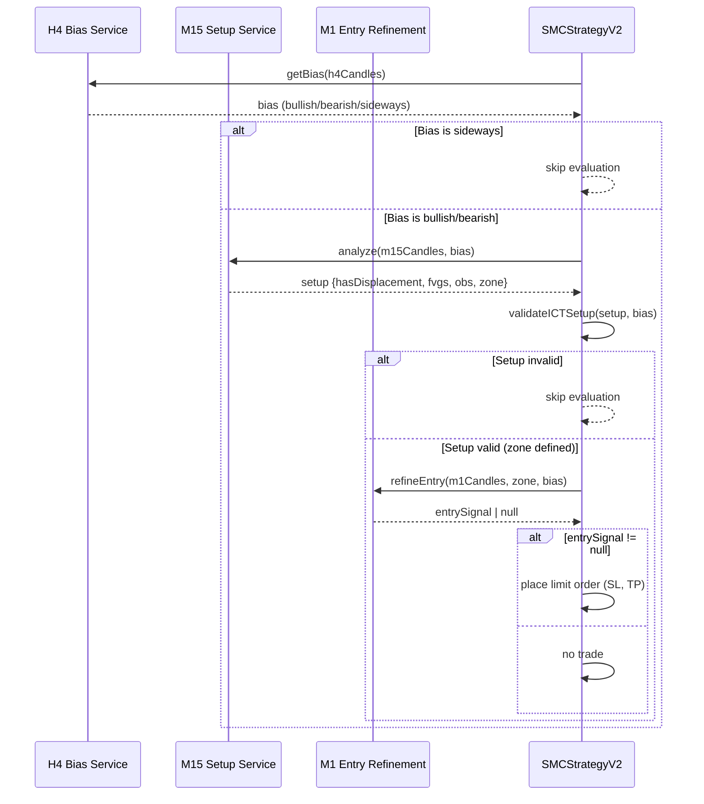

# ICT Pipeline Documentation

This document describes the ICT (Inner Circle Trader) entry model pipeline implemented in the trading engine.

## Pipeline Overview

The ICT model uses a multi-timeframe approach:
- **H4 (Bias TF)**: Determines overall market bias
- **M15 (Setup TF)**: Identifies setup zones (displacement + FVG + OB)
- **M1 (Entry TF)**: Refines entry with local CHoCH and refined OB

## Flowchart

```mermaid
flowchart TD
    A[H4 Candles] --> B[H4 Market Structure<br/>Swings + BOS + CHoCH]
    B --> C{Bias}
    C -->|Bullish| D[Filter: Only long setups]
    C -->|Bearish| E[Filter: Only short setups]
    C -->|Sideways| X[Skip - no trade]

    D --> F[M15 Candles]
    E --> F

    F --> G[M15 Structure<br/>Displacement + BOS + CHoCH]
    G --> H{Valid ICT Setup?<br/>Displacement + FVG + OB}

    H -->|No| X
    H -->|Yes| I[M15 Zone Defined<br/>(FVG or OB)]

    I --> J[M1 Candles]
    J --> K[M1 Structure<br/>Local CHoCH + Swings]

    K --> L{M1 CHoCH inside M15 Zone?}
    L -->|No| X
    L -->|Yes| M[Refined M1 OB]

    M --> N[Place Limit Order<br/>at OB / 50% FVG]
    N --> O[SL under OB (long)<br/>or above OB (short)]
    O --> P[TP at RR × SL<br/>(e.g. 1:3)]

    P --> Q[Log + Backtest Stats]
```

## Sequence Diagram



## Key Components

### H4 Bias Detection (ICTH4BiasService)

- Uses 3-candle pivot for swing detection
- Detects BOS (Break of Structure) to determine bias
- Detects CHoCH (Change of Character) for structure reversals
- Returns: `'bullish' | 'bearish' | 'sideways'`

### M15 Setup Zone (ICTEntryService.detectM15SetupZone)

Requirements:
1. **CHoCH or BOS**: Opposite direction to bias
2. **Displacement**: Candle with body > previous × 1.5 (optional but preferred)
3. **FVG**: Fair Value Gap created during displacement
4. **OB**: Order Block before displacement (demand for bullish, supply for bearish)

Setup zone is defined as the FVG or OB (preferring FVG if both exist).

### M1 Entry Refinement (ICTEntryService.refineM1Entry)

Requirements:
1. Price trades inside/near M15 setup zone
2. M1 CHoCH or BOS in direction of H4 bias
3. Refined M1 OB in direction of bias

Entry price:
- Prefer OB open (low for bullish, high for bearish)
- Fallback to 50% FVG level

Stop Loss:
- Below M1 OB low (bullish) or above M1 OB high (bearish)
- With buffer to avoid noise (e.g., $1 for XAUUSD)

Take Profit:
- Calculated as SL × Risk:Reward ratio (default 1:3)
- Configurable via `SMC_RISK_REWARD` env var

## Environment Variables

- `USE_ICT_MODEL=true`: Enable ICT model (default: false)
- `ICT_DEBUG=true`: Enable detailed ICT logging
- `SMC_RISK_REWARD=3`: Risk:Reward ratio for TP calculation (default: 3)

## Relaxed Requirements

For initial testing, the following requirements are relaxed:

1. **CHoCH**: Can use BOS if no CHoCH detected
2. **Displacement**: Optional (won't block setup validation)
3. **Zone**: Requires FVG OR OB (not both)
4. **Price in Zone**: Allows 10% buffer outside zone
5. **M1 CHoCH**: Can use BOS if no CHoCH detected

These can be made stricter as the model is refined.

## Testing

See `src/strategy/v2/__tests__/ICT_H4_M15_M1_Entry.spec.ts` for unit tests.

Run tests with:
```bash
pnpm test -- ICT_H4_M15_M1_Entry
```

(Note: Install Vitest first: `pnpm add -D vitest @vitest/ui`)

